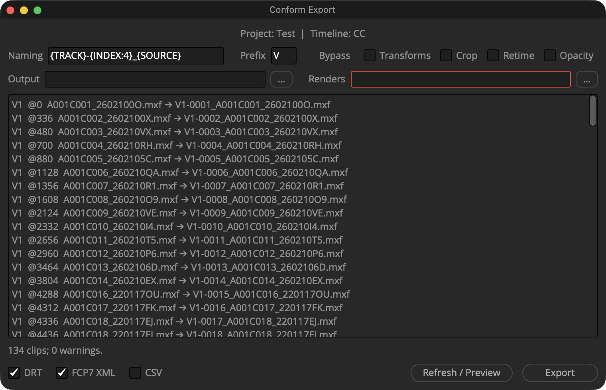

# Conform Export

[](https://github.com/dimmmmmmmer/conform-export/actions/workflows/tests.yml)
[](https://github.com/dimmmmmmmer/conform-export/releases/latest)
[](LICENSE)


A DaVinci Resolve script for the hand-off after grading. You render the timeline as individual clips, and Conform Export writes a timeline that points at those renders, with every clip named after its render file.

You get **FCP7 XML** and **DRT**, plus an optional **CSV** list of names. It replaces the XML from Resolve's *Premiere XML* render preset, which often gets names, trims and speed ramps wrong and cannot write a DRT at all.

<p align="center"></p>

## What it does

- **Names clips like Resolve names individual-clip renders:** `V1-0001_A003C014.mov`, numbered from 1 on every track.
- **Points every clip at its render.** In and out points are recalculated from the render's timecode, so renders trimmed with handles (for example ±10 frames) line up. Reverse clips and mixed frame rates (50p on a 25p timeline) are handled too.
- **Leaves clips offline without a render folder.** Paths to the camera originals are removed, so nothing links back to them. The clips keep the new names and can be relinked later.
- **Bypasses baked-in effects.** Transforms, crop, retime and opacity can each be dropped, so they are not applied twice.
- **Builds the DRT in Resolve itself.** Resolve imports the fixed XML into a temporary bin, exports the DRT, and the bin and timeline are deleted afterwards.
- **Never changes your timeline** and starts no renders.

## Install

1. Install **Python 3.12** from [python.org](https://www.python.org/downloads/). Resolve needs a 64-bit Python 3.9–3.12. On Apple Silicon the Intel-only Homebrew Python will not work.
2. Download **[conform-export.zip](https://github.com/dimmmmmmmer/conform-export/releases/latest/download/conform-export.zip)** from the latest release and unzip it.
3. Run the installer:
   - **macOS:** double-click `Install.command`. If macOS blocks it, right-click it and choose *Open*.
   - **Windows:** double-click `Install.cmd`.
   - **Linux:** `bash Install.sh`
4. Quit Resolve completely and open it again. On Windows and Linux, start it with `Start Resolve` from the install folder the installer prints.
5. Open **Workspace → Scripts → Conform Export**.

No admin rights are needed. The installer copies everything into your user's Resolve folder, so the downloaded folder can be deleted afterwards.

<details>
<summary>Why the installer sets <code>PYTHON3HOME</code> on macOS</summary>

On macOS, Resolve looks for Python 3 only in `$PYTHON3HOME` or in `/usr/local/bin/python3`. If that is missing or has the wrong architecture, Resolve silently hides every Python script from the menu. The installer picks a Python that Resolve can load and sets `PYTHON3HOME` for apps opened from the Dock, now and at every login, through a LaunchAgent. Python itself ignores this variable, so your other tools are not affected.

</details>

## Use

1. Open the timeline you rendered from.
2. Set the options:
   - **Naming:** the name template. The default `{TRACK}-{INDEX:4}_{SOURCE}` matches Resolve's render names. Available fields are `{TRACK}`, `{INDEX}`, `{SOURCE}`, `{TIMELINE}` and `{PREFIX}`; `{INDEX:4}` means four digits with leading zeros.
   - **Prefix:** the letter before the track number. `V` gives `V1`, `V2`…
   - **Bypass:** effects already baked into the renders, which should not be applied again.
   - **Output:** where the files are written.
   - **Renders:** the folder with the rendered clips. This is optional.
3. Click **Refresh / Preview** to check the names, then **Export**.

Files go straight into the output folder: `<timeline>.xml`, `<timeline>.drt`, optionally `<timeline>.csv`, plus `<timeline>_warnings.txt` when there is something to review. Existing files are never overwritten; a new export gets `_2`, `_3`…

**Transforms.** Renders of individual clips from Resolve carry zoom, position and flips baked in, but not speed changes. Once a timeline has been rendered, Resolve itself leaves the transforms of the rendered clips out of its XML. If you export from a timeline that still references the camera originals, turn on **Bypass → Transforms** so the zoom is not applied twice.

## Limitations

- **Speed ramps:** Resolve's own XML gets them wrong, so a ramp is exported as a constant average speed with exact start and end frames. The export lists every such clip in its warnings.
- **Flips:** FCP7 XML cannot carry Inspector flips. You get a warning when a flipped clip's transforms are not baked into its render.
- **Timelines that are not 16:9:** Resolve's XML shifts vertical position. The DRT corrects for this; the XML is left as Resolve writes it.
- **Versions and platforms:** tested with DaVinci Resolve Studio 21 on macOS. The scripting calls it uses have been in Resolve for several major versions, so older releases will probably work, but they are untested. Exact speed-ramp positions need a newer API; where that call is missing, ramps are left offline with a warning. Windows and Linux are covered by automated tests only. Reports from other setups are welcome.

## Uninstall

Delete `Conform Export.py` from Resolve's `Fusion/Scripts/Utility` folder, and the `ConformExport` folder (plus any `ConformExport.backup-*`) in Resolve's user folder. The installer prints both locations. On macOS, also run:

```bash
launchctl unsetenv PYTHON3HOME
rm ~/Library/LaunchAgents/conform-export.python3home.plist
```

## Development

The code is plain Python 3.9+ with no dependencies.

```bash
python3 -m unittest discover -s tests
python3 -m conform timeline.xml --renders /path/to/renders --output out   # conform an XML without Resolve
```

The tests compare the output with a conform that Resolve made itself of the same renders. See `tests/fixtures`; project paths in the fixtures have been anonymised.

Changes are listed in the [changelog](CHANGELOG.md). Bug reports are welcome; please attach the export's `_warnings.txt`.

## License

[MIT](LICENSE)
